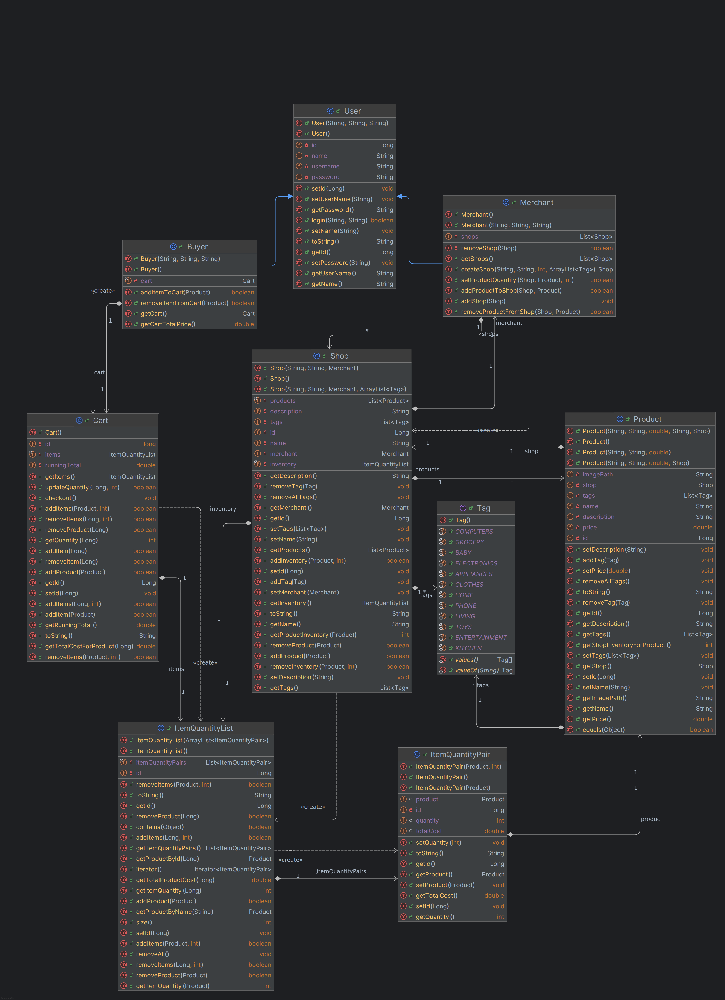
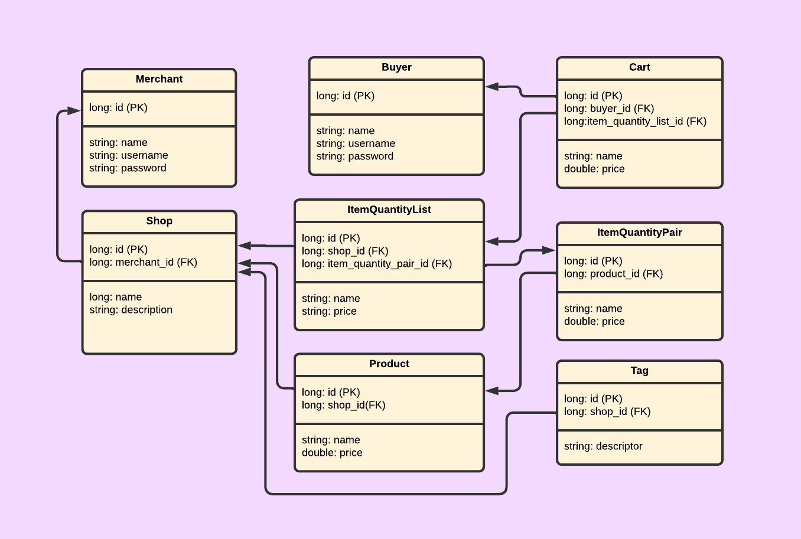

# Mini-Shopify

SYSC 4806 A Project

## Table of Contents

1. [Contributors](#contributors)
1. [Description](#description)
1. [Milestones](#milestones)
1. [Use Cases](#use-cases)
1. [CI/CD/CT](#cicdct)
1. [Issues](#issues)
1. [Kanban](#kanban)
1. [Procedures](#procedures)
1. [Diagrams](#diagrams)

## Contributors

| Name               | Student Number |
| ------------------ | -------------- |
| Arthur Atangana    | 101005197      |
| Nicholai Ponomarev | 101182048      |
| Rebecca Elliott    | 101199034      |
| Michael De Santis  | 101213450      |

## Description

[Visit the Mini-Shopify web application!](https://sysc4806-minishopify-ergyb4hpcef7fufw.canadaeast-01.azurewebsites.net/)

The Mini-Shopify project is a web application, developed using the Java Spring Boot framework, that provides a simple and easy forum for merchants and customers to interact in an online marketplace. Merchants are able to create one or more shops where they may list various products for purchase. Customers may browse merchant shops to view and purchase items, or they may rely on the site's search mechanism to help them find the products they want. Customers may add items to their cart from a vendor's shop, and initiate purchase of the items in their shop through a transaction.

## Milestones

Project milestones.

### Milestone 1: Early Prototype (2024/11/11)

#### Goals

- [x] Project initialization and integration with Spring Boot
- [x] Project Kanban board initialized
- [x] GitHub Issues initialized
- [x] Automated deployment to Azure via GitHub Actions
- [x] Automated testing via GitHub Actions
- [x] Front-end and back-end connectivity
- [x] At least one important use case implemented and functional

#### Completed Use Cases

1. Register a Merchant Account
2. Create a Shop

### Milestone 2: Alpha Release (2024/11/25)

#### Goals

- [x] Implement several additional related features
- [x] Support several related use cases
- [x] Implement integration tests for Controllers
- [x] Update project documentation and diagrams 

#### Completed Use Cases

3. Search a Shop by Name or Tags
4. Register a Buyer Account
5. Login/Logout as a Merchant
6. Login/Logout as a Buyer
7. Add an Item to Shop

### Milestone 3: Final Demo (2024/12/06)

#### Goals

- [x] Implement several additional related features
- [x] Support additional use cases
- [x] Fully establish and integrated features selected for implementation
- [x] Make the product usable and useful for both buyers and merchants
- [x] Remove all elements without functionality
- [x] Refactor code to abide by DRY principle
- [x] Update project documentation and diagrams 
- [x] Integrate web application with external tools
- [x] Ensure GitHub Issues and Kanban board are current

#### Completed Use Cases

8. Add an Item to Cart
9. View and Modify Cart on Cart Dashboard
10. Complete Transaction via Cart Checkout

## Use Cases

Use Cases for this project used to drive the design and implementation.

### Use Case 1: Register a Merchant Account

- Primary Actor:
  - New Merchant User
- Preconditions:
  - None
- Steps:
  1. In a browser, navigate to the Mini-Shopify home page.
  1. Click the **I am a Merchant Login** Button.
  1. Click the **Register here** button to begin the registration process.
  1. Complete the **Create your account**. 
  1. Click the **Create Mini-Shopify Account** button to complete merchant registration.
  1. Peruse the merchant dashboard created for the merchant account.
- Status:
  - Implemented in Milestone 1.

### Use Case 2: Create a Shop

- Primary Actor:
  - Merchant User
- Preconditions:
  - User has registered as a Merchant and is logged in to their account, as per Use Case 1 above.
- Steps:
  1. From the merchant dashboard, click the **Create a Shop** button.
  1. Complete the resultant form with the required shop information.
  1. Create the shop by clicking the **Create Shop** button.
  1. View the shop icon created under the **My Shops** section of the merchant dashboard.
- Status:
  - Implemented in Milestone 1.

### Use Case 3: Search a Shop by Name or Tags

- Primary Actor:
  - User (Merchant or Buyer)
- Preconditions:
  - User has registered and is logged in to their account.
- Steps:
  1. From any page, enter a query into the **Search Bar**.
  1. View the list of results containing all **Shops** that match any search term in their **Name** or list of **Tags**.
- Status:
  - Implemented in Milestone 2.

### Use Case 4: Register a Buyer Account

- Primary Actor:
  - New Buyer User
- Preconditions:
  - None
- Steps:
  1. In a browser, navigate to the Mini-Shopify home page.
  1. Click the **I am a Buyer Login** Button.
  1. Click the **Register here** button to begin the registration process.
  1. Complete the **Create your account** form.
  1. Click the **Create Mini-Shopify Account** button to complete merchant registration.
  1. Peruse the buyer dashboard created for the buyer account.
- Status:
  - Implemented in Milestone 2.

### Use Case 5: Login/Logout as a Merchant

- Primary Actor:
  - Merchant
- Preconditions:
  - User has registered.
- Steps:
  1. In a browser, navigate to the Mini-Shopify home page.
  1. Click the **I am a Merchant Login** Button.
  1. Click the **Login with email** Button.
  1. Enter credentials from registration and click **Login** Button.
  1. At end of session, click the **Account** button and then click **Logout**.
- Status:
  - Implemented in Milestone 2.

### Use Case 6: Login/Logout as a Buyer

- Primary Actor:
  - Buyer
- Preconditions:
  - User has registered.
- Steps:
  1. In a browser, navigate to the Mini-Shopify home page.
  1. Click the **I am a Buyer Login** Button.
  1. Click the **Login with email** Button.
  1. Enter credentials from registration and click **Login** Button.
  1. At end of session, click the **Account** button and then click **Logout**.
- Status:
  - Implemented in Milestone 2.

### Use Case 7: Add an Item to Shop

- Primary Actor:
  - Merchant
- Preconditions:
  - Merchant has registered, is logged into their account, and has an extant shop.
- Steps:
  1. On the merchant home page, click the shop to add a product to.
  1. On the shop page, click the **Add a Product** button.
  1. Complete the form with product details and click **Add Product** button.
- Status:
  - Implemented in Milestone 2.

### Use Case 8: Add an Item to Cart
- Primary Actor:
  - Buyer
- Preconditions:
  - Merchant has an extant shop with items in stock.
  - Buyer is registered and logged in.
- Steps:
  1. On any extant store page with products for sale and in stock, select the product to add to cart.
  1. Set the quantity of product to add to cart using the number input box for **Quantity**. 
      - A quantity may be set either by typing into the box, or by using the increment/decrement buttons.
  1. Add the selected quantity of product to cart by clicking the product's **Add to cart** button.
      - The maximum amount of items that may be added to cart for a particular product is the number of products held in stock in the store inventory; if this quantity is exceed, items will _not_ be moved to cart and the buyer will receive a notification of insufficient inventory.
- Status:
  - Implemented in Milestone 3.

### Use Case 9: View and Modify Cart on Cart Dashboard
- Primary Actor:
  - Buyer
- Preconditions:
  - Buyer is registered and logged in.
- Steps:
  1. From a shop home page, click the **Cart** button in the left-hand navigation bar.
  1. On the resultant Cart Dashboard page, inspect the cart and its products.
      - Inspect cart information, such as cumulative total value of cart.
      - Inspect item-specific information for each product in cart, such as quantity, unit price, and combined price.
  1. On the resultant Cart Dashboard page, modify the items in cart.
      - Update item quantity by setting new quantity and cliocking **Update** button.
      - Remove product from cart by clicking ** Remove Product From Cart** button. 
- Status:
  - Implemented in Milestone 3.

### Use Case 10: Complete Transaction via Cart Checkout
- Primary Actor:
  - Buyer
- Preconditions:
  - Buyer is registered and logged in.
  - Buyer has at least one item in cart.
- Steps:
  1. From the cart dashboard, inspect and confirm items in cart.
  1. To initiate transaction and purchase items in cart, click the **Checkout** button.
- Status:
  - Implemented in Milestone 3. 


## CI/CD/CT

### Continuous Integration (CI)

The Mini-Shopify project is being developed with Continuous Integration (CI) (aka. Trunk-Based Development) practices, as described by [Fowler](https://www.martinfowler.com/articles/continuousIntegration.html).
All source code is version controlled by `git`, with additional CI functionality provided by GitHub.
Once developers have taken their sprint issues at weekly scrums, development branches for each issue are forked from the repository's [mainline](https://github.com/npono21/mini-shopify/tree/main).
When developer's are ready to commit their changes, they issue a **Pull Request (PR)** for the development branch directly against the project mainline, with each PR subject to code reviews by at least 2 other developers.
When a PR is successfully merged, corresponding GitHub issues are closed.

### Continuous Deployment (CD)

This project also takes advantages of the Continuous Deployment (CD) capabilities provided by GitHub Actions.
Upon every successful merge to the repository's [mainline](https://github.com/npono21/mini-shopify/tree/main), the updated application is automatically deployed to [Azure](https://sysc4806-minishopify-ergyb4hpcef7fufw.canadaeast-01.azurewebsites.net/).
The GitHub Actions Workflow for deployment is defined in the file `main_sysc4806-shopify.yml`, and may be actively monitored or later reviewed [here](https://github.com/npono21/mini-shopify/actions/workflows/main_sysc4806-minishopify.yml).

### Continuous Testing (CT)

Unit and integration tests are automatically executed upon every mainline and feature branch _push_ to the remote repository as a GitHub Action. The Workflow for these tests are defined in the file `run-tests.yml`, and may be actively monitored or later reviewed [here](https://github.com/npono21/mini-shopify/actions/workflows/run-tests.yml).

## Issues

For a list of all issues, please refer to the [GitHub Issues](https://github.com/npono21/mini-shopify/issues) page on this project's repository.

## Kanban

To view the Kanban board for this project, please refer to the [GitHub Kanban](https://github.com/users/npono21/projects/2) page on this project's repository.

## Procedures

Relevant retrieval, build, and usage procedures for this project.

### Source Code Retrieval

Retrieve this repository's source code through one of the following methods:

- Clone using HTTPS:
  - `git https://github.com/npono21/mini-shopify.git`
- Clone using SSH:
  - `git clone git@github.com:npono21/mini-shopify.git`
- Clone using GitHub CLI:
  - `gh repo clone npono21/mini-shopify`
- Download the `zip` archive from the [GitHub Repository](https://github.com/npono21/mini-shopify).

### Building and Executing the Project Locally

To build and execute the project locally in IntelliJ, select the `AccessingDataJpaApplication.java` class in the _Project_ browser, and select **Run** (`SHIFT + F10`).

To build and execute the project locally with Maven, execute the following command:
```bash
mvn spring-boot:run
```

### Running Unit and Integration Tests

Unit and integration tests are automatically executed upon every mainline and feature branch _push_ to the remote repository as a GitHub Action; however, tests may also be run locally.
If you wish to execute the entire suite of unit and integration tests locally under Maven, you may issue the following command from the project's root:

```bash
mvn -B test --file pom.xml
```

## Diagrams

Design diagrams generated for this project.

### UML Class Diagram

The current UML class diagram for Milestone 3 is visualized below:


### Database Schema

The current relational database schema design for Milestone 3 is visualized below:


Thanks!!
